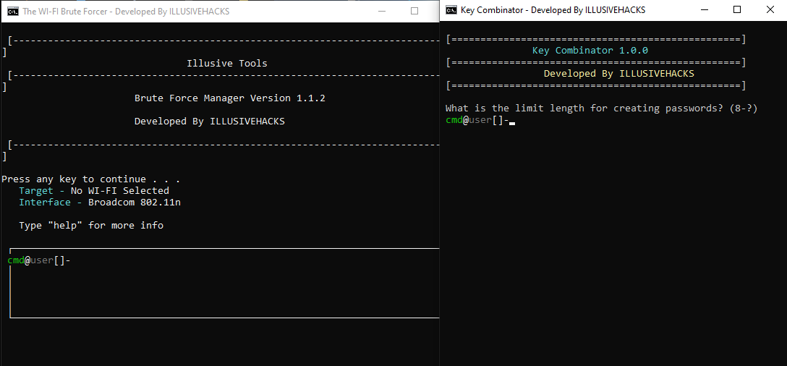
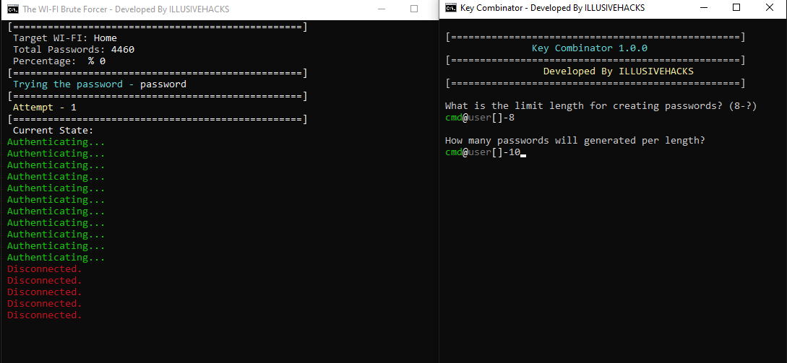

The WI-FI Brute Forcer


Table of Contents
About the Project
Features
Getting Started
Prerequisites
Setup Instructions
Usage Guide
Commands
Screenshots
Contributing
License
Acknowledgements
About the Project
The WI-FI Brute Forcer is a powerful tool designed for educational and security testing purposes. It allows users to perform brute force attacks on wireless networks to test their security robustness.

⚠️ Disclaimer: Use this tool responsibly and only with explicit permission from the network owner.

Features
Automatic network interface detection and selection.
Scanning and listing available WI-FI networks.
Brute-forcing WI-FI passwords using a predefined password list.
Interactive user interface for a smooth experience.
Real-time progress updates during the attack.
Getting Started
Prerequisites
A Windows PC with administrative privileges.
Basic understanding of batch scripting and networking.
Required files in the project directory:
colorchar.exe
colorbox.exe
passlist.txt

Setup Instructions
Clone or download this repository.
bash

````git clone https://github.com/Illusivehacks/wifi-bruteforcer.git````

Place all required files in the BF_Files folder.
Open the project folder in your terminal or command prompt.
Usage Guide

Run the batch script to start the tool:
bash
````bruteforce.bat````
Commands
help: Displays the help menu with all commands.
wifiscan: Scans and lists nearby WI-FI networks.
interface: Allows you to select a specific network interface.
attack: Begins the brute-force attack on the selected network.
Screenshots
Main Interface


WI-FI Scan Results


Contributing
Contributions are welcome! If you have ideas or improvements, please: williamkitungo@gmail.com

Fork this repository.

Create a new branch for your feature:
bash
````git checkout -b feature/AmazingFeature````


Commit your changes:
bash
````git commit -m 'Add some AmazingFeature'````

Push to the branch:
bash
````git push origin feature/AmazingFeature````
Open a Pull Request.
License
This project is licensed under the MIT License. See LICENSE for details.


Key Combinator - Password Generator
Key Combinator is a batch script developed to generate customizable password lists based on user-defined parameters.

Features
Generates passwords of varying lengths.
Combines characters, digits, and symbols for strong password creation.


Allows user customization:
Define password lengths (minimum length of 8).
Specify the number of passwords to generate per length.
Outputs all generated passwords into a text file (passlist_raw.txt) for easy access.

How It Works
Initialization: The script sets up necessary variables and configures the password generation logic.
User Input:
Specify the maximum password length.
Indicate the number of passwords to generate per length.
Password Generation:
For each password, the script randomly selects characters, digits, or symbols.
Passwords are generated iteratively for all specified lengths.
Output:
Generated passwords are saved in passlist_raw.txt in the BF_Files directory.
The total count of generated passwords is displayed upon completion.


Requirements
Place the script in a folder containing colorchar.exe (used for colored text output).
Ensure the BF_Files directory exists in the same location as the script.


How to Use
Run the batch script (.bat file).
Enter the desired parameters when prompted:
Maximum password length.
Number of passwords per length.
Wait for the script to generate passwords.
Find the generated passwords in the passlist_raw.txt file.
Enjoy secure password generation with Key Combinator!

Acknowledgements
Developed by ILLUSIVEHACKS.
UI enhancements powered by Cipher Group.
Visit their WhatsApp Channel. -> https://whatsapp.com/channel/0029VaKenMe0LKZEAnWle521
Special thanks to the open-source community for inspiration and resources.
